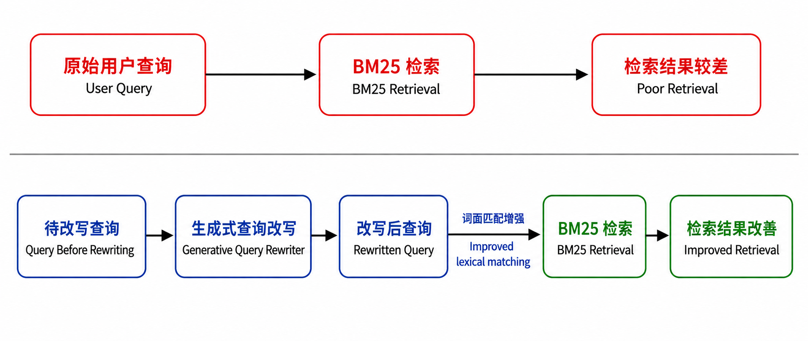
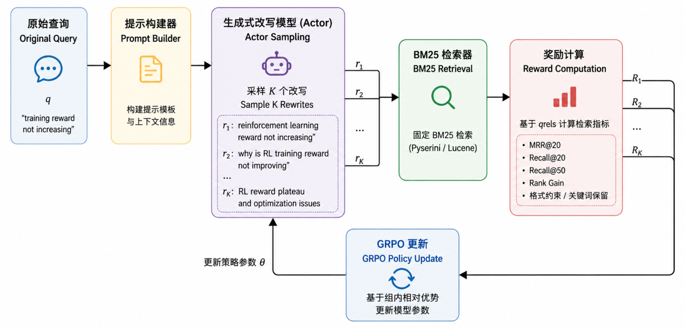
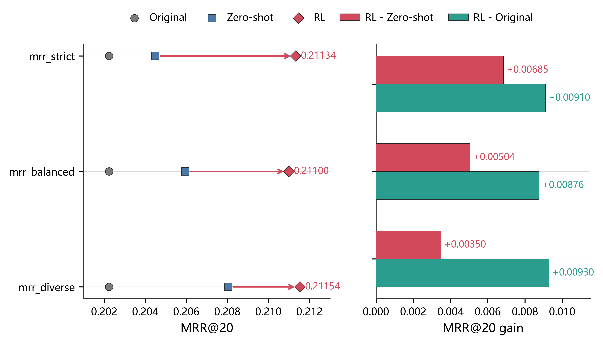
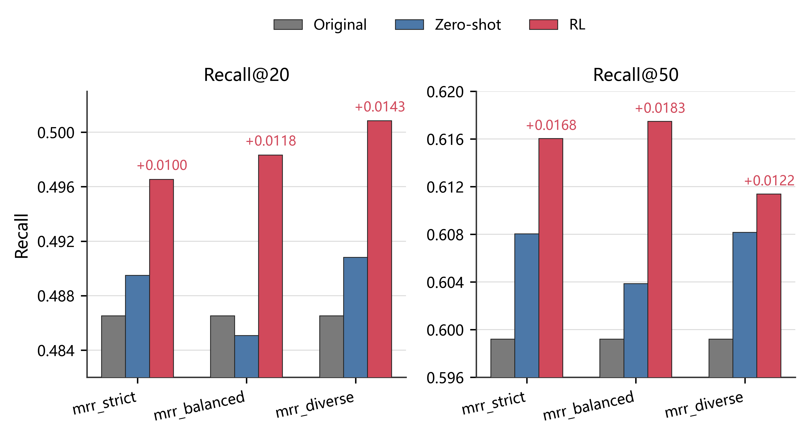
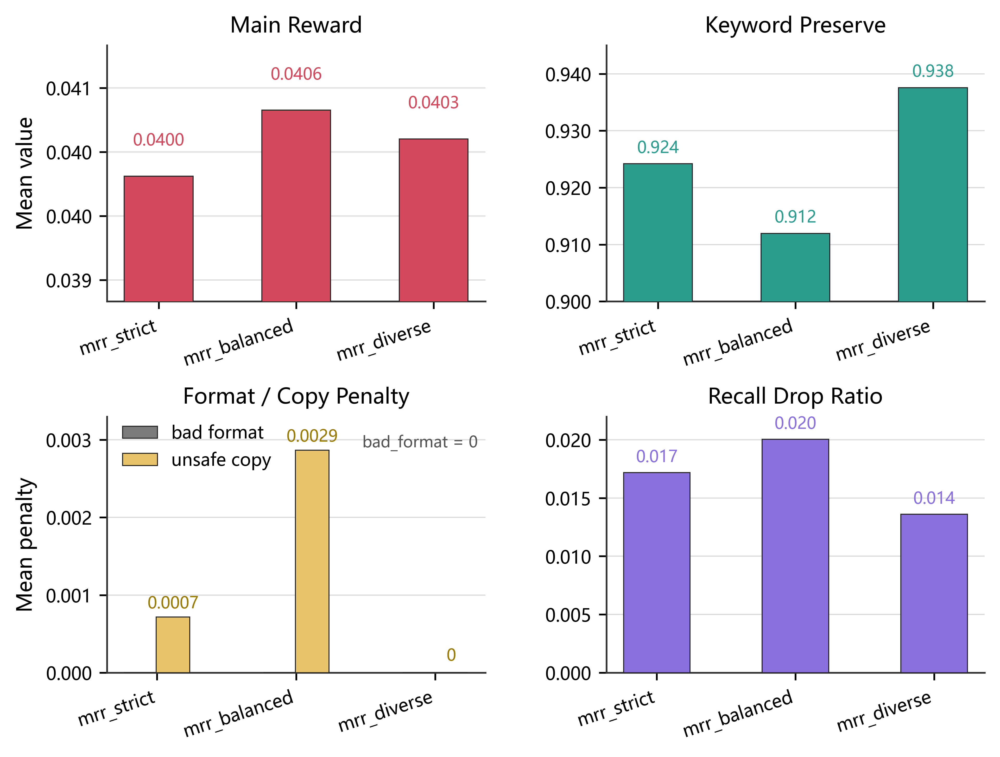

<!-- _class: title-page -->

# 基于强化学习的生成式检索

## Generative Retrieval via Reinforcement Learning

**汇报人：** 晁恒  
**指导老师：** 辛鑫  
**山东大学 计算机科学与技术学院**  
**2026 年 5 月**

---

## 1. 研究背景：BM25 的词面匹配瓶颈

<div class="two-col">
<div class="col-50">

### 背景问题

BM25 是稳定、高效、可复现的稀疏检索基线，但它对 **query 与 passage 的词项重合** 非常敏感。

真实用户输入通常较短、口语化，相关文档却可能使用更正式的实体、术语或同义表达。此时语义上相关，不等于 BM25 排名中容易命中。

</div>

<div class="col-50">

### 一个典型例子

<div class="card" style="padding: 16px 18px;">

<div style="font-size: 24px; font-weight: 700; margin-bottom: 14px;">
how to lower high blood pressure naturally
</div>

<div style="display: grid; gap: 8px; font-size: 19px; line-height: 1.35;">

<div style="border-left: 4px solid #111; padding-left: 10px;">
相关 passage：hypertension lifestyle intervention
</div>

<div style="border-left: 4px solid #111; padding-left: 10px;">
相关 passage：blood pressure reduction through sodium restriction
</div>

<div style="border-left: 4px solid #111; padding-left: 10px;">
相关 passage：aerobic exercise for hypertension control
</div>

</div>

</div>

</div>
</div>

<div class="img-center" style="margin-top: 18px;">



</div>

---

## 3. 方法框架：生成—检索—奖励—更新

<div class="img-center" style="margin-top: 4px;">



</div>


---

## 4. MDP 建模：查询改写作为序列决策

<div class="two-col">
<div class="col-45 compact">

### MDP 对应关系

| MDP 要素 | 本文含义 |
|---|---|
| 状态 $s_t$ | 原 query、prompt、已生成 token |
| 动作 $a_t$ | 下一个 token |
| 策略 $\pi_\theta$ | Qwen3-4B Query Rewriter |
| 环境 | 固定 BM25、corpus 与 qrels |
| 奖励 | MRR、Recall 与约束惩罚 |

</div>
<div class="col-55 compact">

### 一次训练迭代

<div class="flow-list">

1. 输入原始 query $q$
2. Actor 采样生成 $K$ 个候选改写
3. BM25 对每个候选 query 进行检索排序
4. 根据 qrels 计算检索 reward
5. GRPO 根据组内相对优势更新 LoRA 参数

</div>

</div>
</div>

<div class="formula wide-formula">

### 强化学习形式化

$$
q' \sim \pi_\theta(\cdot \mid q), \qquad \mathcal{R}(q')=[d_1,d_2,\ldots,d_k]
$$

$$
r(q,q') = f\bigl(\mathrm{MRR@20},\mathrm{Recall@20},\mathrm{Recall@50},\mathrm{Penalty}\bigr)
$$

$$
\max_\theta\;\mathbb{E}_{q\sim \mathcal{D},\ q'\sim\pi_\theta}
\left[r(q,q')\right]
$$

BM25 排名不可微，检索指标不能直接反向传播到模型参数。因此本文将检索结果转化为 reward，用强化学习优化 Query Rewriter。

</div>

---

## 5. Prompt 约束：从 100+ 组提示词与参数中筛选

<div class="two-col">
<div class="col">

### 调试目标

围绕 BM25 检索目标，实际测试了 100+ 组 prompt 与生成参数组合，重点比较四类问题：

- 实体、数字、年份、缩写和否定约束是否保留；
- 输出是否稳定为单行英文 query；
- 是否出现解释文本、Markdown、标签、多候选输出；
- temperature、top-p、max token 对稳定性和多样性的影响。


</div>
<div class="col">

### 最终 Prompt 核心约束

```text
Return only one concise English search query.
Preserve entities, numbers, years, abbreviations and constraints.
Prefer terms likely to appear verbatim in MS MARCO passages.
Do not answer, explain, use Markdown, or output multiple candidates.
```


</div>
</div>

---

<!-- _class: formula -->
## 6. Reward 设计：检索收益 + 约束扣分

### 主奖励：相对原始 query 的检索增益

$$
r_{main}=\Delta\mathrm{MRR@20}
+\lambda_{20}\Delta\mathrm{Recall@20}
+\lambda_{50}\Delta\mathrm{Recall@50}
+b_{rank}
$$

### 完整奖励：收益项减去风险项

$$
r=r_{main}
-\lambda_{drop}P_{drop}
-\lambda_{fmt}P_{fmt}
-\lambda_{edit}P_{edit}
-\lambda_{copy}P_{copy}
$$

<div class="grid2">
<div class="card">
<h3>召回下降扣分 $P_{drop}$</h3>
<p>改写后 Recall 明显低于原 query 时扣分，避免只冲前排而牺牲覆盖率。</p>
</div>
<div class="card">
<h3>格式污染扣分 $P_{fmt}$</h3>
<p>空输出、多行、解释文本、标签、Markdown、非英文比例过高时扣分。</p>
</div>
<div class="card">
<h3>语义漂移扣分 $P_{edit}$</h3>
<p>实体、数字、关键词保留不足时扣分，防止把 query 改成另一个问题。</p>
</div>
<div class="card">
<h3>机械复制扣分 $P_{copy}$</h3>
<p>完全复制、重复 token、无有效改写时扣分，促使模型学习有效词项重组。</p>
</div>
</div>

---

<!-- _class: formula -->
## 7. GRPO 更新：组内相对优势

### 同一 query 下比较多个候选改写

对同一个 query 采样 $K$ 个 rewrite，得到奖励 $r_1,\dots,r_K$，再做组内归一化：

$$
A_i=\frac{r_i-\mathrm{mean}(r_1,\dots,r_K)}{\mathrm{std}(r_1,\dots,r_K)+\varepsilon}
$$

### PPO-style clipped objective

$$
\rho_t(\theta)=\exp\left(\log\pi_\theta(a_t|s_t)-\log\pi_{old}(a_t|s_t)\right)
$$

$$
L_{pg}=-\mathbb{E}_t\left[\min\left(\rho_tA_t,\mathrm{clip}(\rho_t,1-\epsilon,1+\epsilon)A_t\right)\right]
$$

$$
L=L_{pg}+\beta L_{KL}
$$

> 高 reward 候选被增强，低 reward 候选被抑制；KL 约束用于防止策略偏离基座模型过远。

---

## 8. 训练策略：课程采样 + Phase2 三变体

<div class="two-col">
<div class="col compact">

### 训练主线

| 阶段 | 目标 | 作用 |
|---|---|---|
| Phase1 | recall-first | 先学会保留语义边界，减少改坏 query |
| Phase2 | MRR-oriented | 在有效样本上强化 Top-20 前排排序 |
| Full Eval | 三路对比 | 比较 Original、Zero-shot、RL 的真实收益 |

### 课程采样

| 类型 | 原始 BM25 表现 | 训练价值 |
|---|---|---|
| A 桶 | Recall@100 有命中，MRR@20 不高 | 主训练样本 |
| B 桶 | 原 query 几乎无命中 | 少量探索 |
| C 桶 | 原 query 已经较强 | 防止过度改写 |

</div>
<div class="col compact">

### Phase2 三个变体

| 变体 | 学习率 | KL beta | temperature / top-p | 取向 |
|---|---:|---:|---:|---|
| mrr_strict | $6\times10^{-6}$ | 0.045 | 0.82 / 0.93 | 更强调 MRR |
| mrr_balanced | $5\times10^{-6}$ | 0.050 | 0.84 / 0.94 | 兼顾 MRR 与 Recall |
| mrr_diverse | $7\times10^{-6}$ | 0.040 | 0.88 / 0.96 | 更强探索 |

<div class="note">
设计逻辑：先用课程采样控制训练信号质量，再用三组 Phase2 配置比较不同探索强度和排序目标下的收益稳定性。
</div>

</div>
</div>

---

## 9. 实验设置与评价方式

<div class="two-col">
<div class="col compact">

### 固定实验配置

| 项目 | 设置 |
|---|---|
| 数据集 | MS MARCO passage dev subset |
| 检索器 | Pyserini / Lucene BM25 |
| 基座模型 | Qwen3-4B-Instruct-2507 |
| 微调方式 | 4bit LoRA，$r=16$，$\alpha=32$，dropout=0.05 |
| 强化学习算法 | GRPO |
| 完整评估规模 | 1396 条 validation query |

</div>
<div class="col">

### 三路对比

<div class="card"><b>Original</b><br/>原始 query 直接输入 BM25，表示不做改写的检索基线。</div>
<div class="card"><b>Zero-shot</b><br/>基座模型按同一 prompt 改写，但不加载 RL adapter。</div>
<div class="card"><b>RL</b><br/>相同 prompt 下加载 Phase2 训练得到的 LoRA adapter。</div>

### 主要指标

<span class="tag">MRR@20</span>
<span class="tag">Recall@20</span>
<span class="tag">Recall@50</span>
<span class="tag">Reward breakdown</span>

</div>
</div>

---

## 10. 主结果：MRR@20 稳定提升

<div class="two-col">
<div class="col img-center">



</div>
<div class="col small">

### 主要结论

三个 RL 变体的 MRR@20 均高于 Original 和 Zero-shot，说明检索指标驱动的训练带来了额外收益，而不只是 prompt 本身有效。

### RL - Zero-shot 增量

- **mrr_strict：+0.00685**
- **mrr_balanced：+0.00504**
- **mrr_diverse：+0.00350**

### 观察

- **mrr_diverse** 的绝对 MRR@20 最高：**0.21154**；
- **mrr_strict** 的相对提升最大，说明更集中地优化了前排排序；
- 三个变体均为正收益，说明结果不是单一配置下的偶然现象。

</div>
</div>

---

## 11. Recall 结果：没有以牺牲覆盖率换 MRR

<div class="two-col">
<div class="col img-center">



</div>
<div class="col small">

### Recall@20

- mrr_strict：**0.49654**
- mrr_balanced：**0.49833**
- mrr_diverse：**0.50084**

### Recall@50

- mrr_strict：**0.61605**
- mrr_balanced：**0.61748**
- mrr_diverse：**0.61139**

### 说明

RL 在 Recall@20 与 Recall@50 上整体不低于 Original。这说明 MRR 提升不是通过过度收缩 query、牺牲召回来换取的。

</div>
</div>

---

## 12. Reward Breakdown：改写行为是稳定的

<div class="two-col">
<div class="col img-center">



</div>
<div class="col small">

### 稳定性指标

- **Main reward** 三个变体均为正；
- **Keyword preserve** 均高于 0.91，说明核心语义锚点保留较好；
- **Bad format = 0**，说明输出基本满足单行英文 query 格式；
- **Unsafe copy penalty** 很低，说明不是简单复制原 query；
- **Recall drop ratio** 较低，说明多数改写没有明显伤害召回。

### 判断

模型收益主要来自更合理的词项选择、补充和重组，而不是异常格式、无意义扩展或偶然噪声。

</div>
</div>

---

## 13. 局限与后续工作

<div class="card" style="margin-bottom: 18px;">

### 当前局限

- 目前主要在 **MS MARCO + BM25** 场景下验证，数据集和检索器覆盖还不够广；
- Reward 依赖离散检索指标，训练信号仍然相对稀疏；
- 当前研究的是单轮查询改写，尚未覆盖多轮上下文、复杂意图和跨领域检索任务。

</div>

<div class="card">

### 后续工作

- 扩展到更多数据集、更多 query 类型和不同检索器设置；
- 继续优化 reward 权重、课程采样和候选生成策略；
- 探索与 dense retrieval、hybrid retrieval 的结合；
- 对失败样本进行更细粒度的错误归因，区分语义漂移、召回下降和格式污染。

</div>

<div class="note">
结论：在固定 BM25 环境下，把检索指标作为强化学习反馈，可以让 LLM 学到更适合稀疏检索的查询表达。
</div>

---

<!-- _class: title-page -->
# 致谢

感谢辛鑫老师在选题、实验设计和论文撰写过程中的指导。  
感谢山东大学计算机科学与技术学院提供的学习与研究支持。  
感谢各位老师的审阅与指导。

**恳请各位老师批评指正。**

**Q & A**
